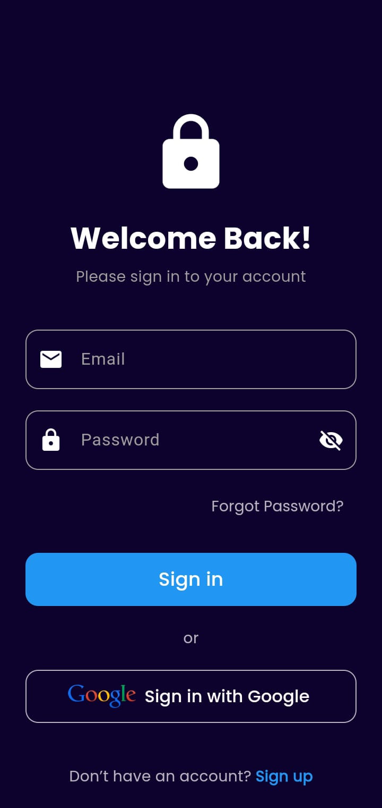
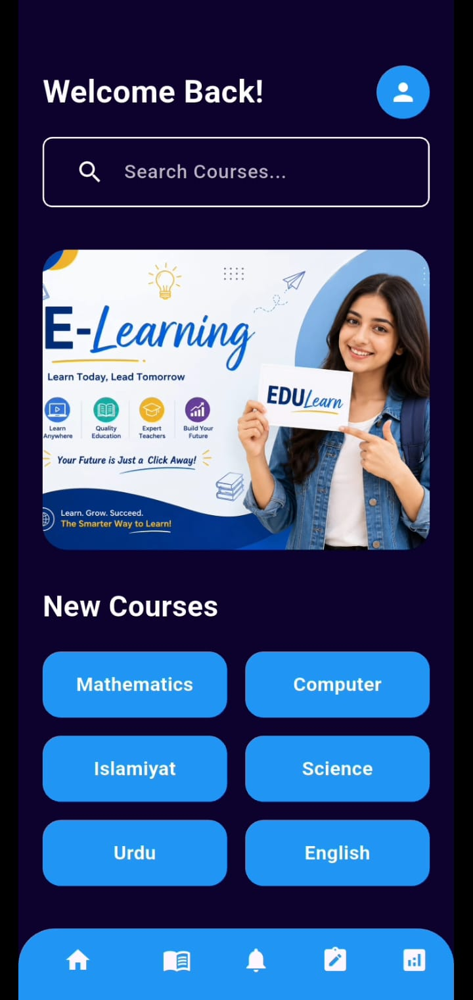
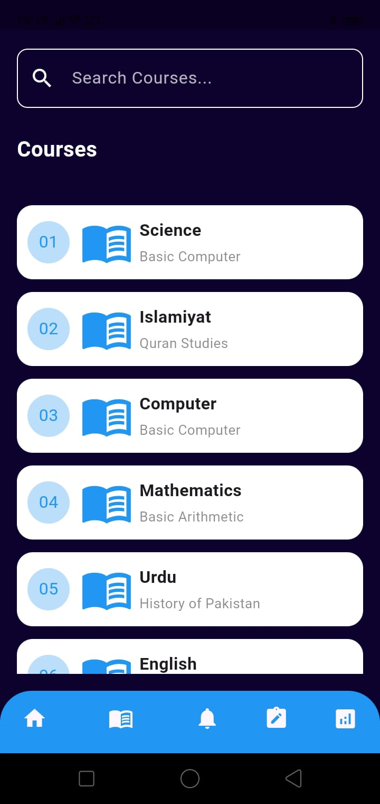
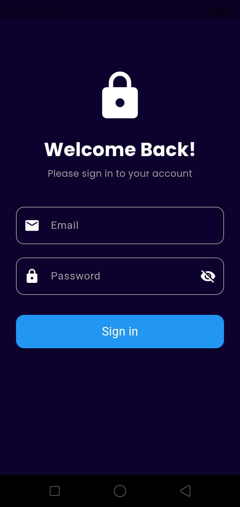
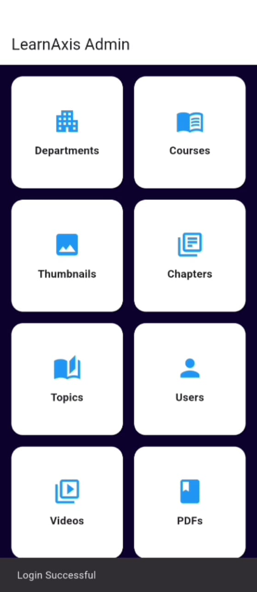

## 🙋 About This Project
This project was developed as my Final Year Project (BSCS 2026).  
It reflects my interest in Flutter development and scalable e-learning solutions.

# 📚 FYP E-Learning Platform

A modern academic e-learning platform developed as a Final Year Project (FYP).  
The application provides structured online access to courses, lessons, quizzes, assignments, and progress tracking.

---

## 🚀 Overview
- Centralized digital environment for academic learning
- Separate functionality for **Students**, **Instructors**, and **Administrators**
- Scalable **Flutter architecture** for maintainability and future expansion

---

## 🎓 Student Features
- Secure registration & login  
- Password recovery & profile management  
- Browse courses & subjects  
- Enroll in courses  
- Access video/text/PDF lessons  
- Attempt quizzes & submit assignments  
- View results, feedback & progress tracking  
- Notifications & activity history  

---

## 👩‍🏫 Instructor Features
- Manage courses & subjects  
- Add/update lessons & materials  
- Create/manage quizzes & assessments  
- Review student submissions & assignments  
- Monitor participation & performance  
- Track student progress  

---

## 🛠️ Administrator Features
- Manage student & instructor accounts  
- Control courses, subjects & content  
- Role-based access management  
- Monitor platform activity & system data  

---

## 🧑‍💻 Technology Stack
**Frontend & Mobile:** Flutter, Dart, Material Design, Android SDK  
**Authentication:** Firebase Auth, JWT, RBAC  
**Backend:** Node.js, Express.js, RESTful APIs  
**Database & Storage:** MongoDB Atlas, Firebase Firestore, Firebase Storage  
**Deployment:** Google Play Store, Firebase, GitHub, GitHub Actions  
**Testing Tools:** Flutter Test, Android Emulator, DevTools, Postman  

---

## 🏗️ Application Architecture
- **Presentation Layer:** Screens, Widgets, State Management  
- **Domain Layer:** Business logic, Entities, Use Cases  
- **Data Layer:** Models, Repositories, API Services, Firebase/DB  
- **Core Layer:** Utilities, Constants, Themes, Routing, Error Handling  

---

## 📂 Project Structure
lib/
├── main.dart
├── app/ (routes, theme)
├── core/ (constants, errors, services, utils, widgets)
├── features/ (auth, courses, subjects, lessons, quizzes, assignments, progress, profile, notifications)
└── l10n/

Code

---

## 📖 Core Modules
- **Authentication:** Registration, login, password recovery, roles  
- **Courses & Subjects:** Listing, details, enrollment, categories  
- **Lessons:** Video, text, PDF, navigation, completion tracking  
- **Quizzes:** MCQs, auto-scoring, results & feedback  
- **Assignments:** Creation, submission, deadlines, evaluation  
- **Progress Tracking:** Completion %, quiz scores, assignment results  

---

## 🔄 Data Flow
Flutter UI → State Management → Use Case → Repository → Data Source → Database/Cloud

Code

---

## 📦 Suggested Flutter Packages
- `flutter_riverpod` (state management)  
- `go_router` (navigation)  
- `dio` (network)  
- `firebase_core`, `firebase_auth`, `cloud_firestore`  
- `shared_preferences` (local storage)  
- `video_player` (media)  
- `path_provider` (file/PDF support)  

---

## 🔐 Security
- Secure authentication & role-based authorization  
- HTTPS communication & token/session management  
- Firebase Security Rules  
- Input validation & protected API endpoints  

---

## 📈 Future Enhancements
- Live classes & discussion forums  
- Certificates & attendance management  
- Payment integration  
- Teacher & admin dashboards  
- AI learning assistant  
- Offline learning & push notifications  
- Gamification (badges, leaderboards, milestones)  

---

## ⚙️ Installation & Setup
1. Install prerequisites: Flutter SDK, Dart SDK, Android Studio, Git  
2. Clone repository:  
   ```bash
   git clone https://github.com/shumailaashraf005-web/fyp-e-learning-platform.git
   cd fyp-e-learning-platform/finalproject
Install dependencies:

bash
flutter pub get
Connect Android device / start emulator

Run application:

bash
flutter run
Build release APK:

bash
flutter build apk --release
🧪 Testing
Unit Testing: flutter test

Widget Testing: flutter test test/

Device Testing: Authentication, navigation, quizzes, progress tracking, performance

🛤️ Roadmap
Video-based learning

Gamification features

AI-powered personalized learning

Offline access & push notifications

Enhanced dashboards & accessibility

✅ Conclusion
The FYP E-Learning Platform delivers a structured digital learning environment with a scalable, feature-based architecture.
It lays the foundation for future enhancements such as AI-assisted learning, gamification, live classes, and advanced dashboards.

## 📸 Project Screenshots

### 🚀 Splash Screen


### 🌐 Online Learning Platform


### 🔑 Login Screen


### 📊 Dashboard


### 📚 Courses


### 🔒 Admin Login


### 🌸 Admin Dashboard



📜 License
This project is licensed under the MIT License – see the [Looks like the result wasn't safe to show. Let's switch things up and try something else!] file for details.
